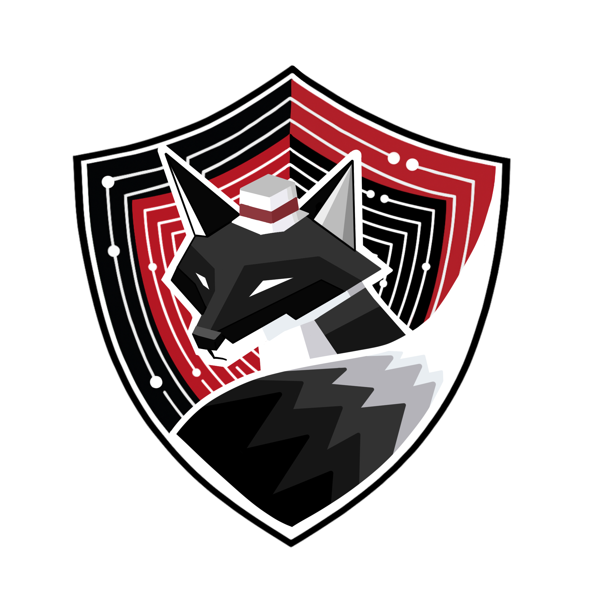
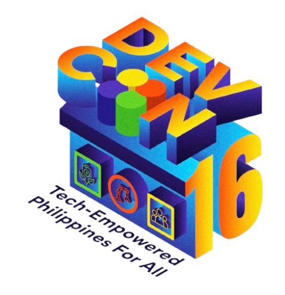

# Greetings! I am Nicole Margareth Sibal 👋

A **3rd year Cybersecurity student** at **Holy Angel University (HAU)**. I am interested in **digital forensics**, **robotics**, and **psychology**.

## 🏆 Milestones & Community
## 🏆 Milestones & Community
- **Leadership**:  Vice President of Internal Affairs of Cybersecurity Intelligence Alliance
- **Volunteerism**:
  -  DEVCON Pampanga Core Team Member
  -  AWS e:Novators Programs Committee Member

## 💻 Tech Stack

### Digital Forensics

### Programming

### Network & System

## 🌐 Connect With Me!

